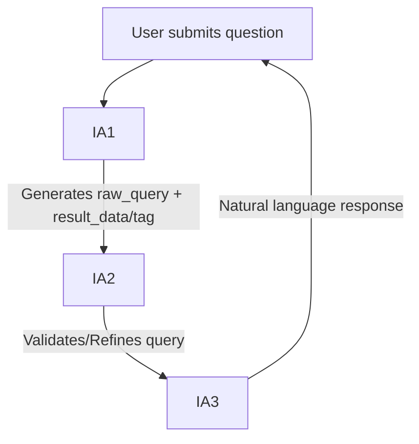
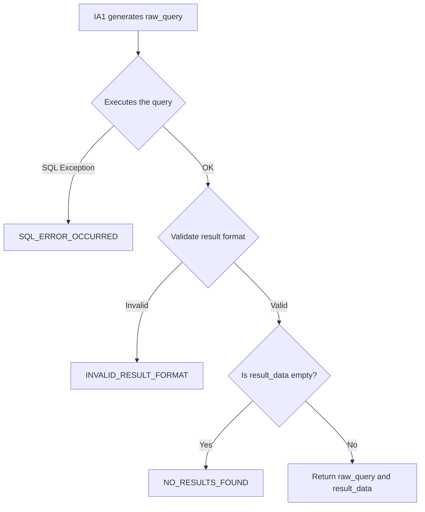
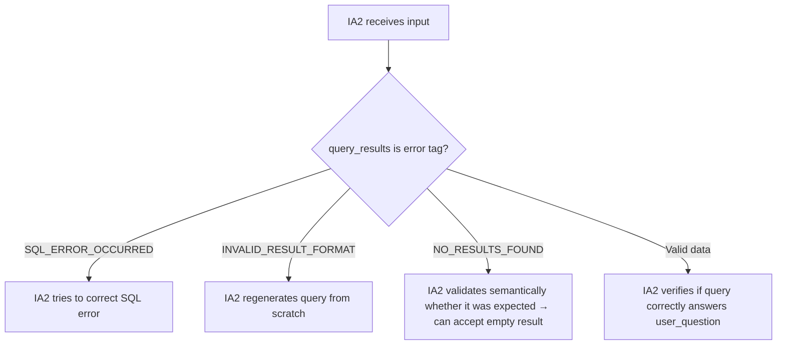
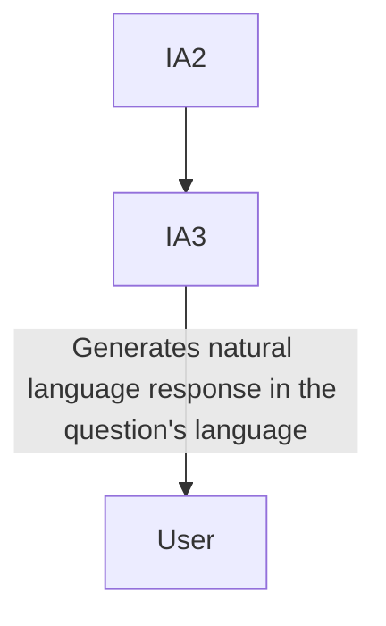

# LangQueryGen

LangQueryGen is a modular AI-powered backend that transforms natural language questions into SQL queries using **Retrieval-Augmented Generation (RAG)** with **LangChain**, **Ollama** (local LLM like Mistral 7B), and **Flask**. The system also includes semantic validation of user input and a Node.js layer for interaction or interface.

---

## 🚀 Features

- 🔍 **Natural Language to SQL** with LangChain and a local model (via Ollama)
- 🧠 **RAG pipeline** with FAISS and HuggingFace embeddings
- ✅ **Input validation agent** for filtering sensitive questions
- 🛠️ **Modular Flask API** structure
- 🧩 **Node.js Integration** for frontend or orchestration
- 🔒 **Fully local and secure** – no external API calls

---

## 📁 Project Structure

```
flask-server/
├── app.py                 # Flask entry point
├── routes/                # API routes (Blueprint)
├── services/              # LangChain agents and logic
├── models/                # Pydantic request/response models
├── utils/                 # Auxiliary functions (e.g., query fixer)
├── venv/                  # Python virtual environment
├── package-lock.json      # Node.js dependencies
└── ...
```

---

## 👩‍💻 How to Run (Backend)

### 1. Clone the repo and create the virtual environment

```bash
git clone https://github.com/raphael-santosz/LangQueryGen.git
cd LangQueryGen/flask-server
python -m venv venv
source venv/bin/activate  # or .\venv\Scripts\activate on Windows
pip install -r requirements.txt
python app.py
```

---

## 👩‍💻 How to Run (Frontend)

```bash
cd client
npm install
npm run dev
```

---

## 📆 Requirements

- Python 3.10+
- Node.js 18+
- Ollama installed locally
- SQL Server or compatible DB
- Optional: FAISS, LangChain, HuggingFace embeddings

---

## ⚙️ Technologies

- 🐍 Flask + Pydantic
- 🧠 LangChain + Ollama + HuggingFace
- 🫮 SQLAlchemy
- 🌐 Node.js (for UI or extended API)
- 🧠 Mistral 7B / LLaMA3

---

## 🛡️ Security

The validation agent checks whether the user input relates to sensitive topics like **salary** or **payment**, returning `"Blocked"` if found.\
All LLM interactions are **local and secure**, ensuring full data privacy.

---

## ✨ Authors

Developed by **Raphael Augusto Santos**  and **Rafael Azzolini**\
[GitHub](https://github.com/raphael-santosz)

---

## 🗜️ General System Architecture



---

## IA1 - Query Execution Flow

1. **IA1 generates `raw_query`** (using LLM + schema + examples)
2. **Executes the Query**: `conn.execute(raw_query).fetchall()`



### Summary of possible IA1 outputs:

| Case                          | Output                                               |
| ----------------------------- | --------------------------------------------------- |
| SQL Exception                 | `"SQL_ERROR_OCCURRED"`                              |
| Invalid result                 | `"INVALID_RESULT_FORMAT"`                           |
| Query returned no results      | `"NO_RESULTS_FOUND"`                                |
| Query with valid results       | `{ "query": raw_query, "result_data": result_data }` |

---

## IA2 - Query Validation and Refinement Flow

1. **IA2 receives:** `user_question`, `generated_query`, `query_results`, `schema`

2. **Decides flow based on `query_results` tag:**



### Notes:

- If `SQL_ERROR_OCCURRED` → IA2 can fix things like quotes, joins, aliases, etc.
- If `INVALID_RESULT_FORMAT` → IA2 assumes IA1 produced a bad query → must regenerate.
- If `NO_RESULTS_FOUND` → IA2 can accept result if it was semantically expected (e.g., non-existent employee).
- If `result_data` is valid → IA2 performs semantic validation to verify if the query answers the question correctly.

---

## IA3 - Natural Language Response



- IA3 always receives:

  - user_question
  - query_results
  - formatting_guide
  - answering_guide

- IA3:

  - If `NO_RESULTS_FOUND` or `SQL_ERROR_OCCURRED` → returns a polite response.
  - If valid results → responds with the results following the `answering_guide`.

---

## Final Notes

- The system is designed to be **modular, robust, and traceable**.
- The IA1 tags help IA2 avoid being confused by raw SQL errors or invalid results.
- The complete pipeline is controlled: IA1 → IA2 → IA3.

---

🚀 **Ready for production or to be extended with other databases / models / UIs.**

---
