# LangQueryGen

LangQueryGen is a robust AI-driven backend designed to convert natural language questions into SQL queries using a **Retrieval-Augmented Generation (RAG)** approach. It leverages **LangChain**, **Ollama** (local LLMs such as LLaMA 3 and Gemma:7B-Instruct), and **Flask** for query orchestration. The system ensures secure, fully local execution with built-in semantic validation and seamless integration with Node.js for interface or automation layers.

---

## 🚀 Key Capabilities

* **Natural Language → SQL Translation** using local LLMs and structured schema prompts
* **RAG Pipeline** powered by FAISS vector search and E5/HuggingFace embeddings
* **Input Validation Agent** for enforcing security and access control
* **Modular Backend Architecture** with Flask and clean service separation
* **Frontend/API Gateway Compatibility** via Node.js
* **Offline-First Design** – all AI operations are performed locally, no cloud dependency

---

## 📁 Project Layout

```
LangQueryGen/
├── flask-server/              # Backend (Flask + LangChain)
│   ├── app.py                 # Entry point
│   ├── models/                # Pydantic request/response schemas
│   ├── prompts/               # Structured LLM prompts
│   ├── routes/                # Flask route definitions (Blueprints)
│   ├── secrets/               # (Optional) API keys or protected data
│   ├── services/              # Core logic and LangChain agents
│   ├── uploads/               # Temporary file storage
│   ├── utils/                 # Helper functions (e.g., SQL fixers)
│   └── venv/                  # Python virtual environment

├── frontend/                  # Frontend (Next.js + TypeScript)
│   ├── src/                   # Pages, components, logic
│   ├── messages/              # Translation/i18n support
│   ├── public/                # Static assets
│   ├── .env.local             # Environment configuration
│   ├── next.config.ts         # Next.js configuration
│   └── tsconfig.json          # TypeScript setup

├── requirements.txt           # Python dependencies
└── README.md
```

---

## 🛠️ How to Run the Project

### Backend (Flask)

```bash
# Clone the repository
git clone https://github.com/raphael-santosz/LangQueryGen.git
cd LangQueryGen/flask-server

# Create and activate virtual environment
python -m venv venv
source venv/bin/activate  # On Windows: .\venv\Scripts\activate

# Install Python dependencies
pip install -r requirements.txt

# Start the Flask API
python app.py
```

### Frontend (Next.js)

```bash
cd ../frontend

# Install Node.js dependencies
npm install

# Start the development server
npm run dev
```

---

## ⚙️ Stack & Requirements

**Core Technologies**

* Python 3.10+ with Flask + Pydantic
* Node.js 18+ with Next.js (UI or orchestration)
* LangChain + Ollama (local LLMs like LLaMA3, Gemma:7B-Instruct)
* SQLAlchemy + SQL Server (or compatible DB)
* FAISS + HuggingFace embeddings (optional for enhanced retrieval)

**Setup Notes**

* Ollama must be installed and running locally.
* No external API calls: full offline processing for privacy and control.

---
## 🧠 AI Agents & Prompt Logic

LangQueryGen orchestrates four specialized AI agents, each with a distinct role in the natural language-to-SQL pipeline. The system dynamically selects prompt files and adapts behavior based on the user's access level:

| AI Agent | Responsibility                                                   | LLM Used            | Prompt Scope (Based on Access Level)                            |
|----------|------------------------------------------------------------------|---------------------|------------------------------------------------------------------|
| IA1      | Generates and executes the SQL query based on the user’s question | `llama3:8b`         | `lowAccess_primary.txt` or `highAccess_primary.txt`             |
| IA2      | Validates and refines the SQL query if needed                    | `llama3:8b`         | `lowAccess_validate.txt` or `highAccess_validate.txt`           |
| IA4      | Analyzes uploaded documents and extracts contextual answers      | `llama3:8b`         | `document_reader.txt` (universal)                               |
| IA3      | Synthesizes a final answer combining query results and context   | `gemma:7b-instruct` | `formatting_guide.txt`, `answering_guide.txt` (universal)       |

### 🔐 Prompt Routing Based on Access Level

| Access Level        | Prompt Files Used                                  | Allowed Data Scope                                         |
|---------------------|----------------------------------------------------|------------------------------------------------------------|
| Standard Employee   | `lowAccess_primary.txt`, `lowAccess_validate.txt`  | Personal data + public company policy information          |
| Manager/Admin       | `highAccess_primary.txt`, `highAccess_validate.txt`| Full access to all employee records and internal HR data   |

> IA3 and IA4 always use universal prompts regardless of access level.

---

## 🧩 System Architecture


---

## IA1 – Query Generation & Execution

```mermaid
flowchart TD
    Start[IA1 receives question + user_name] --> Guard{Violates security rules?}
    Guard -->|Yes| Blocked[Return BLOCKED → skip IA2]
    Guard -->|No| GenQuery[Generate raw_query via LLM and examples] --> ExecQuery{Run query in database}

    ExecQuery -->|SQL Error| SQL_ERROR[Return SQL_ERROR_OCCURRED]
    ExecQuery -->|Invalid result| INVALID[Return INVALID_RESULT_FORMAT]
    ExecQuery -->|Empty result| EMPTY[Return NO_RESULTS_FOUND]
    ExecQuery -->|Valid result| SUCCESS[Return query and result_data]
```



### Responsibilities

* Interpret the user question and generate a SQL query using a local LLM with schema prompt and examples.
* Execute the query directly on the database connection.
* Return the result or raise appropriate signals in case of error or access denial.

### Inputs Received

* `user_question`
* `user_name` (for validation agent)
* `schema_prompt` + `examples`

### Output Scenarios

| Scenario                 | Output                                                |
| ------------------------ | ----------------------------------------------------- |
| Access denied            | "BLOCKED"                                             |
| SQL Exception            | "SQL\_ERROR\_OCCURRED"                                |
| Invalid result format    | "INVALID\_RESULT\_FORMAT"                             |
| Query with no results    | "NO\_RESULTS\_FOUND"                                  |
| Query with valid results | { "query": raw\_query, "result\_data": result\_data } |

---

## IA2 – Query Validation & Semantic Refinement


### Responsibilities

* Refine or regenerate queries based on the outcome of IA1.
* Detect and correct issues like syntax errors, logic flaws, or misinterpretations.
* Ensure the final query semantically answers the user’s question.

### Inputs Received

* `user_question`
* `generated_query` (from IA1)
* `query_results`
* `schema`

### Output Scenarios

| Scenario                | IA2 Action                                       |
| ----------------------- | ------------------------------------------------ |
| SQL\_ERROR\_OCCURRED    | Attempt SQL fix (e.g., aliasing, quote mismatch) |
| INVALID\_RESULT\_FORMAT | Regenerate the query completely                  |
| NO\_RESULTS\_FOUND      | Determine if result is valid or expected         |
| Valid data returned     | Perform semantic validation on query             |

---

## IA4 – Document Reader & Context Extractor


### Responsibilities

* Process the document uploaded by the user and extract relevant textual information.
* Use a specialized prompt to generate a possible natural language answer based on the document.
* Return the extracted context (`doc_answer`) for enrichment in the final response (via IA3).

### Inputs Received

* `user_question`
* `file_url` (path to uploaded document)

### Processing Steps

1. Extract text content from the provided file (`.txt`, `.pdf`, `.docx`, etc.).
2. Load and fill the `document_reader.txt` prompt with:

   * `input` = user question
   * `text_document` = full extracted text
3. Execute the prompt with the local LLM (e.g. `llama3:8b`).
4. Return the model’s answer if valid.

### Output Scenarios

| Scenario                      | IA4 Output               |
| ----------------------------- | ------------------------ |
| No file or extraction failed  | ""                       |
| No relevant information found | "NO\_DOCUMENT\_DATA"     |
| Valid answer from document    | Extracted natural answer |

---

## IA3 – Natural Language Generation & Final Output


### Responsibilities

* Generate a human-friendly response in the same language and tone of the original question.
* Use the `formatting_guide` and `answering_guide` to adapt content, terminology and structure.
* Merge database results with any extracted document-based answer (`doc_answer`), when available.
* Gracefully handle special scenarios such as blocked access or missing results.

### Inputs Received

* `user_question`
* `query_results` (from IA1 or refined by IA2)
* `doc_answer` (optional, from IA4)
* `formatting_guide`
* `answering_guide`
* `blocked` flag (if present)

### Output Scenarios

| Scenario                  | IA3 Response Example                                          |
| ------------------------- | ------------------------------------------------------------- |
| Valid result              | "Carlos earns €4,500 per month as of March 2023."             |
| No results found          | "No matching records were found for your query."              |
| SQL/system error          | "We couldn’t complete your request due to a technical issue." |
| Access blocked            | "Access to this information is restricted."                   |
| Document result available | Combines SQL data + document insight in a unified response    |

---

## 👥 Authors

* [Raphael Augusto Santos](https://github.com/raphael-santosz)
* [Rafael Azzolini](https://github.com/rafaelazzolini1)
